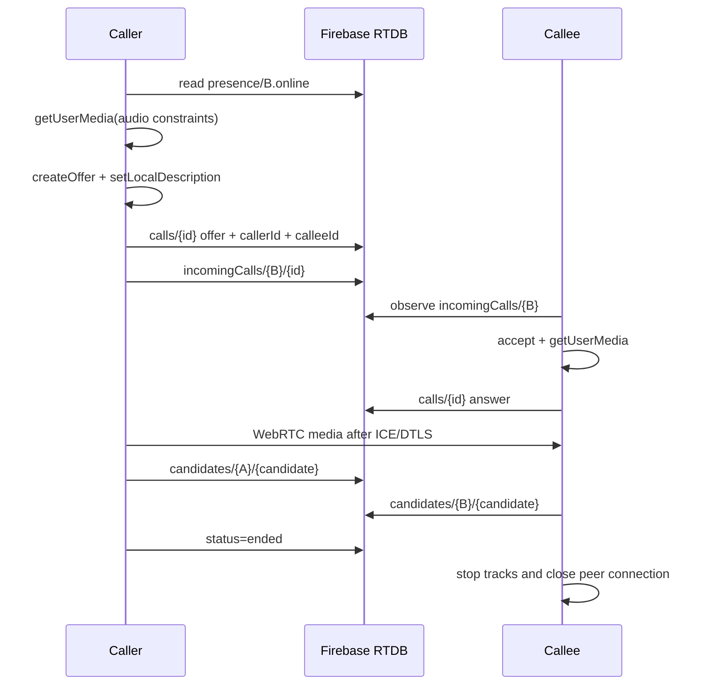

# BSDC RTC Architecture

## Current production boundary

BSDC direct calls use WebRTC `RTCPeerConnection` with Firebase Realtime Database signaling. Firebase carries call metadata, SDP, ICE candidates, presence, and incoming-call records. Media travels peer-to-peer and never through Firebase.

The client includes:

- Direct-call presence gating: an outgoing call is rejected immediately unless `presence/{uid}.online` is true.
- Offer/answer exchange and trickle ICE candidate exchange.
- Candidate queuing until `setRemoteDescription` completes.
- 30-second unanswered-call timeout.
- Echo cancellation, noise suppression, automatic gain control, mono capture, and Opus-capable recording.
- Universal incoming-call listener and alert mounted above the router.
- Managed ringtone lifecycle, accept, decline, mute, unmute, and end-call controls.

## Signaling sequence



## RTDB payloads

`calls/{callId}`:

```json
{
  "id": "call-id",
  "callerId": "uid-a",
  "calleeId": "uid-b",
  "status": "ringing|connected|ended",
  "createdAt": 1730000000000,
  "offer": { "type": "offer", "sdp": "..." },
  "answer": { "type": "answer", "sdp": "..." }
}
```

`calls/{callId}/candidates/{uid}/{candidateId}` stores `RTCIceCandidate.toJSON()`.

`incomingCalls/{calleeUid}/{callId}` stores the caller summary and timestamp. The RTDB rules restrict call reads and writes to the caller/callee and incoming records to the receiving user or the authenticated caller creating that user’s record.

## Audio constraints

```ts
const stream = await navigator.mediaDevices.getUserMedia({
  audio: {
    echoCancellation: true,
    noiseSuppression: true,
    autoGainControl: true,
    channelCount: 1,
    sampleRate: 48_000,
  },
});

const connection = new RTCPeerConnection({
  iceServers: [
    { urls: 'stun:stun.l.google.com:19302' },
    { urls: 'stun:stun1.l.google.com:19302' },
  ],
});
```

AEC, NS, and AGC are browser/OS media-engine features. They reduce echo and noise but cannot guarantee zero latency or zero echo on every device. The remote stream must be rendered exactly once through one audio element; BSDC does that with the call hook's `remoteAudioRef`.

The BSDC audio engine additionally routes the microphone through `MediaStreamAudioSourceNode -> BiquadFilterNode(highpass 80Hz) -> DynamicsCompressorNode -> MediaStreamAudioDestinationNode`. The destination is never connected to `AudioContext.destination`, so the local microphone cannot feed back into the local speaker. Opus sender parameters target 128 kbps, 48 kHz fullband speech, in-band FEC, and DTX; the sender is reduced to 96 kbps or 64 kbps when live quality metrics degrade.

## Diagnostics

`RTCPeerConnection.getStats()` is sampled once per second. BSDC tracks candidate-pair RTT, inbound audio jitter, inbound and remote-inbound packet loss, remote audio level, and measured bitrate. Quality thresholds are:

- Excellent: RTT <= 80 ms, jitter <= 20 ms, loss <= 1%.
- Good: RTT <= 150 ms, jitter <= 40 ms, loss <= 3%.
- Degraded: RTT <= 250 ms, jitter <= 80 ms, loss <= 8%.
- Poor: anything above those limits.

The client adapts bitrate without renegotiating. It does not claim DSCP control because browsers and mobile operating systems do not expose reliable application-level DSCP tagging.

## Presence contract

`presence/{uid}` is written by the authenticated user’s active BSDC session and should be maintained with Firebase `onDisconnect`:

```json
{
  "online": true,
  "lastSeen": 1730000000000
}
```

A call button performs a fresh read before creating an offer. Presence is advisory because a device can disappear between the read and the call write; the 30-second timeout and call status listener handle that race.

## SFU upgrade path

STUN-only P2P is appropriate for one-to-one calls but is not a production guarantee for restrictive NATs, corporate networks, or group calls. The production architecture should use an SFU such as LiveKit, mediasoup, Janus, or Agora:

1. A trusted backend authenticates the BSDC user and issues a short-lived room token.
2. The caller and callee join the same room through the SFU.
3. The SFU forwards one encoded Opus stream per participant and prevents mesh fan-out.
4. Firebase/FCM remains the signaling and wake-up layer for ringing, but never stores media credentials or long-lived tokens.
5. A TURN server must be configured for P2P fallback or for the SFU deployment itself.

Required environment/configuration before enabling an SFU client:

- `VITE_LIVEKIT_URL` or provider equivalent.
- A server-side token endpoint; never generate provider tokens in the browser.
- TURN credentials or a managed provider with TURN enabled.
- FCM high-priority data notifications and Android foreground call service for locked-screen ringing.

## Background and locked-device behavior

A browser tab cannot reliably play continuous audio while suspended or while the device is locked. The current universal overlay works while BSDC is active, and the service-worker notification works when notification permission is granted. Reliable locked-screen calling requires native Android integration: FCM data messages, a foreground service, a full-screen notification, audio focus, and a native call lifecycle. Those pieces must be implemented and tested on a physical Android device; they cannot be guaranteed by React/WebRTC alone.
